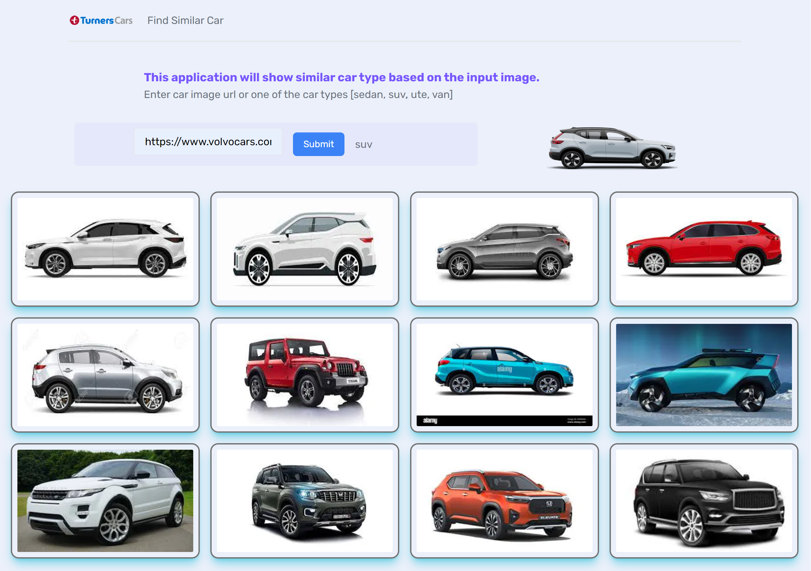

# 🚗 Similar Car Finder: AI-Powered Car Type Identifier

A full-stack web application built with Next.js that leverages **Microsoft Azure AI Vision** to analyze uploaded car photos and identify their type. Users can upload images of cars, and the application will use AI to predict the vehicle's classification.

## ✨ Core Features

- **AI-Powered Car Type Identification:** Utilizes Azure AI Vision service to analyze car images and determine their type (e.g., Sedan, SUV, Truck).
- **Image Upload:** User-friendly interface for uploading car photographs.
- **Results Display:** Clearly presents the identified car type and potentially other relevant information from the AI analysis.
- **Modern Web Stack:** Built with Next.js (React) for a fast and responsive user experience.
- **Server-Side Logic:** API routes in Next.js handle communication with the Azure AI Vision service.
- **Type Safety:** Developed with TypeScript for enhanced code quality and maintainability.
- **Styled with Tailwind CSS:** Modern and utility-first CSS framework.

## 🖼️ Screenshots

| Desktop                                              |
| ---------------------------------------------------- |
|  |

#### Presentation:

https://www.loom.com/share/0bc3928fe023479495ecb9e552a16f57?sid=b3b80ef7-1859-4f5a-b05a-d5457ca51e38

### URL: https://missionready-m2.vercel.app/

## 🔎 How It Works

1.  **Upload:** The user uploads an image of a car through the web interface.
2.  **Backend Processing:** The image is sent to a Next.js API route on the server.
3.  **Azure AI Vision Analysis:** The backend communicates with the Azure AI Vision service, sending the image for analysis.
4.  **Data Retrieval:** Azure AI Vision processes the image and returns analysis data, which can include object detection, image categorization, or tags relevant to identifying the car type.
5.  **Result Interpretation:** The backend processes the response from Azure to extract the most likely car type.
6.  **Display:** The identified car type is sent back to the frontend and displayed to the user.

## 🛠️ Tech Stack

**Core Framework & Libraries:**

- **Framework:** [Next.js](https://nextjs.org/) (v13.4) - The React Framework for Production.
- **UI Library:** [React](https://reactjs.org/) (v18)
- **DOM Rendering:** [React DOM](https://reactjs.org/docs/react-dom.html) (v18)

**AI & Cloud Services:**

- **Microsoft Azure AI Vision:** The core AI service for image analysis and car type identification. (Likely using the Azure SDK for JavaScript/TypeScript or REST APIs).

**Backend & Database (if applicable for storing results/user data):**

- **Database ODM:** [Mongoose](https://mongoosejs.com/) (v8.0.3) - Elegant MongoDB object modeling.
- **Database Driver:** [MongoDB Native Driver](https://www.mongodb.com/docs/drivers/node/current/) (v6.3.0)
- **Environment Variables:** [dotenv](https://github.com/motdotla/dotenv) (v16.3.1)

**Language & Styling:**

- **Language:** [TypeScript](https://www.typescriptlang.org/) (v5)
- **Styling:** [Tailwind CSS](https://tailwindcss.com/) (v3.3.0)
- **CSS Processing:** [PostCSS](https://postcss.org/) (v8), [Autoprefixer](https://github.com/postcss/autoprefixer) (v10.0.1)

**Development & Tooling:**

- **Linting:** [ESLint](https://eslint.org/) (v8) with `eslint-config-next` (v14.0.3)
- **Type Definitions:** For Node, React, Mongoose.

### Built With

[![Azure AI][azure-ai]][Azure-AI-Custom-Vision-url]
[![Next.js][Next.js]][Next-url]
[![Typescript][typescript]][Typescript-url]
[![Tailwind css][tailwindcss]][Tailwind-url]
[![vercel][vercel]][vercel-url]
[![mongodb][mongodb]][mongodb-url]

[azure-ai]: https://img.shields.io/badge/azure-ai-green?style=for-the-badge&logo=microsoft&logoColor=blue
[Azure-AI-Custom-Vision-url]: https://azure.microsoft.com/en-us/products/ai-services/ai-custom-vision
[typescript]: https://img.shields.io/badge/typescript-ts-blue?style=for-the-badge&logo=typescript&logoColor=blue
[Typescript-url]: https://www.typescriptlang.org/
[Next.js]: https://img.shields.io/badge/next.js-000000?style=for-the-badge&logo=nextdotjs&logoColor=white
[Next-url]: https://nextjs.org/
[tailwindcss]: https://img.shields.io/badge/Tailwind-css-blue?style=for-the-badge&logo=tailwindcss&logoColor=blue
[Tailwind-url]: https://tailwindcss.com/
[vercel]: https://img.shields.io/badge/vercel-white?style=for-the-badge&logo=vercel&logoColor=black
[vercel-url]: https://vercel.com/
[mongodb]: https://img.shields.io/badge/mongodb-db-green?style=for-the-badge&logo=mongodb&logoColor=green
[mongodb-url]: https://www.mongodb.com/

## 🚀 Getting Started

To get a local copy up and running, follow these steps.

### Prerequisites

- [Node.js](https://nodejs.org/) (v16.x or newer recommended)
- [npm](https://www.npmjs.com/) (comes with Node.js) or [Yarn](https://yarnpkg.com/)
- **Azure Account:** An active Microsoft Azure subscription.
- **Azure AI Vision Resource:** You need to have an AI Vision (or Cognitive Services) resource created in your Azure portal. You'll need the **Endpoint** and one of the **Keys** for this resource.
- [MongoDB](https://www.mongodb.com/try/download/community) instance (Optional, if you plan to store analysis results or user data)

### Installation

1.  **Clone the repository:**

    ```bash
    git clone https://github.com/jericrealubit/missionready-m2.git
    cd missionready-m2
    ```

2.  **Install dependencies:**
    Using npm:

    ```bash
    npm install
    ```

    Or using Yarn:

    ```bash
    yarn install
    ```

3.  **Set up Environment Variables:**
    Create a `.env.local` file in the root of your project. This file is ignored by Git.

    ```env
    # .env.local

    # Azure AI Vision Credentials
    AZURE_VISION_ENDPOINT=your_azure_vision_endpoint_url
    AZURE_VISION_KEY=your_azure_vision_api_key

    # MongoDB Connection (Optional - if used)
    # MONGODB_URI=your_mongodb_connection_string

    # Add any other environment variables your application needs
    # NEXT_PUBLIC_SOME_API_KEY=your_public_api_key
    ```

    _Replace placeholders with your actual Azure AI Vision endpoint and key, and MongoDB URI if used._

## 📜 Available Scripts

In the project directory, you can run:

### `npm run dev` or `yarn dev`

Runs the app in development mode. Open [http://localhost:3000](http://localhost:3000).

### `npm run build` or `yarn build`

Builds the app for production to the `.next` folder.

### `npm run start` or `yarn start`

Starts the production server (requires `npm run build` first).

### `npm run lint` or `yarn lint`

Runs ESLint to analyze your code.

## 📁 Project Structure (Simplified Next.js)

```bash
missionready-m2/
├── .next/
├── node_modules/
├── pages/
│ ├── api/
│ │ └── identify-car.ts # Example API route for Azure AI Vision interaction
│ ├── _app.tsx
│ ├── _document.tsx
│ └── index.tsx # Main page for image upload and results
├── public/
├── src/ # Optional: For components, utils, Azure SDK integration logic
│ ├── components/
│ └── services/
│ └── azureVisionService.ts # Logic for interacting with Azure AI Vision
├── styles/
├── .env.local
├── .eslintrc.json
├── next.config.js
├── package.json
├── postcss.config.js
├── tailwind.config.ts
├── tsconfig.json
└── README.md
```

_(The project structure includes a suggestion for where Azure service logic might reside)._

## 🤖 API Routes for Azure Integration

The Next.js API routes (e.g., `pages/api/identify-car.ts`) will be responsible for:

1.  Receiving the uploaded image from the client.
2.  Securely authenticating and sending the image data to the Azure AI Vision API.
3.  Processing the JSON response from Azure.
4.  Sending the relevant car type information back to the client.

## 🤝 Contributing

Contributions are welcome! Please follow these steps:

1.  Fork the Project
2.  Create your Feature Branch (`git checkout -b feature/AmazingFeature`)
3.  Commit your Changes (`git commit -m 'Add some AmazingFeature'`)
4.  Push to the Branch (`git push origin feature/AmazingFeature`)
5.  Open a Pull Request

## 📄 License

This project is currently unlicensed. Consider adding an open-source license if you wish.
